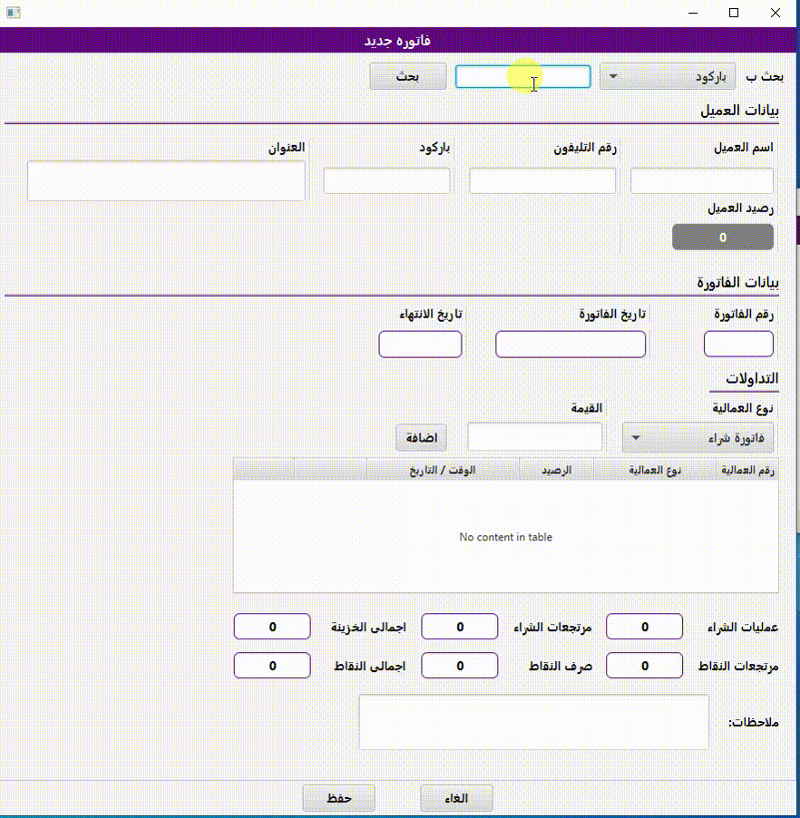
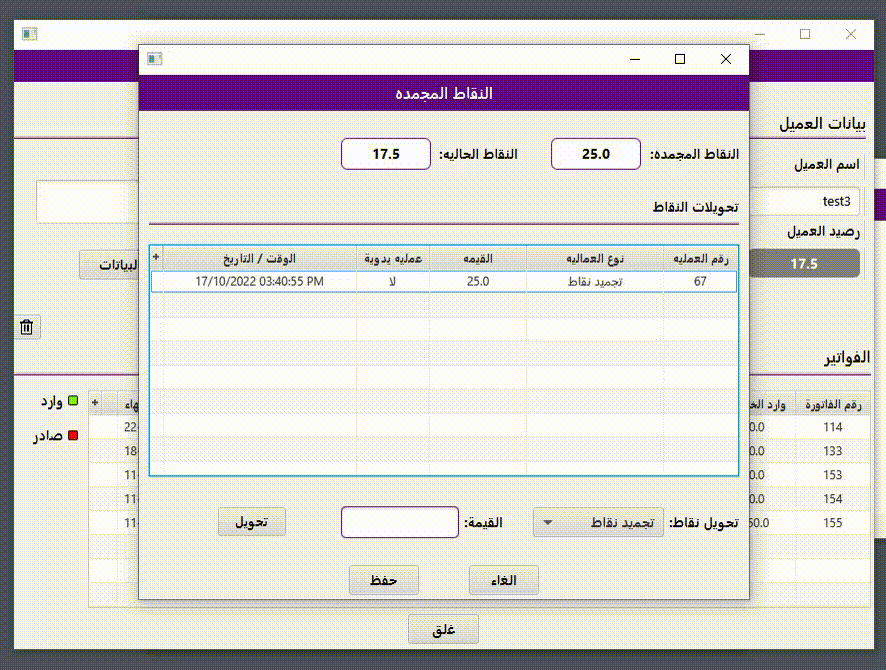

# Pharmacy gifts Card
- Java Desktop application, with a local centralized DMS (ORACLE), used in pharmacies as a secondary application to increase sales growth, currently working in a pharmacy called fayed pharmacy
## Application main usage
- Logs customer transactions, provide extra credit on purchased items in customer account with expiry date from date of the purchase, customer owns a (barcode) credit card for the pharmacy, to use this credit for further transactions
### customer gifts card sample

## Application business goal
- customers the more they buy orders from the pharmacy the more they can collect a free credit in their account to use it so this will make the customer stay connected to the pharmacy (collecting and using free credit) and increase pharmacy sales
##	Roles covered in this project
- gathering system requirements from the client, system design, database design, building database framework for DML operations, implementation, testing and deployment

# Screens
## Login Screen

## Home

## new invoice

- create new invoice
## Customer search screen

- search by name , mobile number , gifts card id via barcode scanner
- search by no of points 
## Customer Data screen

- show customer invoices
- you can select any invoice and (update,delete)
## customer points transaction
- you can transfer points from expired state to available and vice versa

## Transaction history

- show transaction history in a certain time
- print a transactions summary
## Settings

- auto database backup settings
- set expiry date for the given point to the customer
- set the pounds to points ratio
- server connection settings
